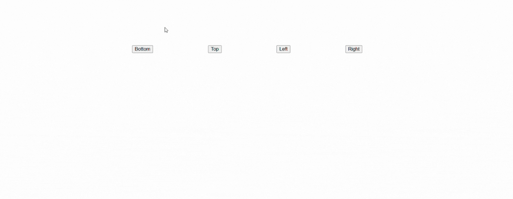

# Soft Tooltips

A Simple Tooltip Module

## Installation

Install @softheartengineer/soft-tooltips with npm

```bash
  npm install @softheartengineer/soft-tooltips
```

## Usage/Examples

```javascript
import { Tooltip } from '@softheartengineer/soft-tooltips';

const tooltip = new Tooltip();

// HTML Element getter
const button1 = document.getElementById('some-button-1');
const button2 = document.getElementById('some-button-2');
const button3 = document.getElementById('some-button-3');
const button4 = document.getElementById('some-button-4');

// Tooltip element with image
let customElement = document.createElement('img');
customElement.src =
  'https://steamcdn-a.akamaihd.net/steam/apps/2581610/header.jpg';

// USAGE
tooltip.onHover(button1, customElement, {
  placement: 'bottom',
  marginTop: 4,
  delay: 100,
});
tooltip.onHover(button2, 'Top Tooltip', {
  placement: 'top',
  marginBottom: 8,
});
tooltip.onHover(button3, 'Left Tooltip', {
  placement: 'left',
  marginRight: 4,
});
tooltip.onHover(button4, 'Right Tooltip', {
  placement: 'right',
  marginLeft: 4,
});
```

## Demo



## Tooltip Configuration Reference

| Events         | Type          |
| :------------- | :------------ |
| `placement`    | `string`      |
| `marginLeft`   | `number (px)` |
| `marginRight`  | `number (px)` |
| `marginTop`    | `number (px)` |
| `marginBottom` | `number (px)` |
| `delay`        | `number (ms)` |
| `hidingDelay`  | `number (ms)` |

## Contributing

Contributions are always welcome!.

## Authors

- [@JaydevVadachhak](https://www.github.com/JaydevVadachhak)

## Support

For Support, email jayvadachhak@gmail.com and follow [@softheartengineer](https://www.instagram.com/softheartengineer?utm_source=ig_web_button_share_sheet&igsh=ZDNlZDc0MzIxNw==).
