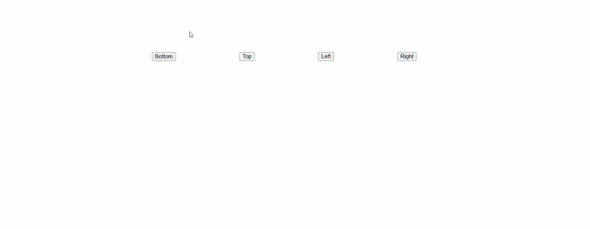

# Soft Tooltips

A Simple, Feature-Rich Tooltip Library

## Installation

Install @softheartengineer/soft-tooltips with npm

```bash
npm install @softheartengineer/soft-tooltips
```

## Basic Usage

```javascript
import { Tooltip } from '@softheartengineer/soft-tooltips';

const tooltip = new Tooltip();

// Get HTML elements
const button1 = document.getElementById('button-1');
const button2 = document.getElementById('button-2');

// Simple text tooltip on hover
tooltip.onHover(button1, 'Hover tooltip', {
  placement: 'top',
  marginBottom: 8,
});

// Custom HTML content tooltip on click
const customContent = document.createElement('div');
customContent.innerHTML = '<h3>Custom Tooltip</h3><p>With HTML content!</p>';

tooltip.onClick(button2, customContent, {
  placement: 'bottom',
  theme: 'light',
  showArrow: true,
});
```

## Demo



## Features

- **Multiple Trigger Types**: Show tooltips on hover, click, or both
- **Flexible Positioning**: Place tooltips on any side (top, bottom, left, right)
- **Auto-Adjustment**: Tooltips automatically adjust to stay within viewport
- **Visual Indicators**: Optional arrow indicators showing tooltip direction
- **Theming Support**: Built-in dark and light themes, plus custom theme option
- **Animation Effects**: Smooth fade-in/out animations
- **Touch Device Support**: Special handling for touch devices
- **Accessibility**: ARIA attributes for screen readers
- **Follow Cursor**: Option to make tooltips follow the cursor
- **Custom Styling**: Apply your own CSS classes

## API Reference

### Initialization Methods

#### `init(element, content, options)`

Initialize a tooltip with full configuration options.

#### `onHover(element, content, options)`

Initialize a tooltip that appears on hover.

#### `onClick(element, content, options)`

Initialize a tooltip that toggles on click.

### Management Methods

#### `show(element, content, options)`

Manually show a tooltip.

#### `hide()`

Manually hide the current tooltip.

#### `destroy(element)`

Remove all tooltip functionality from an element.

### Configuration Options

| Option              | Type                                     | Default     | Description                              |
| ------------------- | ---------------------------------------- | ----------- | ---------------------------------------- |
| `placement`         | `'top'`, `'bottom'`, `'left'`, `'right'` | `'bottom'`  | Tooltip placement relative to element    |
| `marginTop`         | `number`                                 | `4`         | Top margin in pixels                     |
| `marginBottom`      | `number`                                 | `0`         | Bottom margin in pixels                  |
| `marginLeft`        | `number`                                 | `0`         | Left margin in pixels                    |
| `marginRight`       | `number`                                 | `0`         | Right margin in pixels                   |
| `delay`             | `number`                                 | `0`         | Delay before showing tooltip (ms)        |
| `hidingDelay`       | `number`                                 | `0`         | Delay before hiding tooltip (ms)         |
| `showArrow`         | `boolean`                                | `true`      | Show direction arrow indicator           |
| `theme`             | `'dark'`, `'light'`, `'custom'`          | `'dark'`    | Tooltip theme                            |
| `className`         | `string`                                 | `undefined` | Custom CSS class                         |
| `trigger`           | `'hover'`, `'click'`, `'both'`           | `'hover'`   | Trigger type                             |
| `animation`         | `boolean`                                | `true`      | Enable animations                        |
| `animationDuration` | `number`                                 | `300`       | Animation duration (ms)                  |
| `autoAdjust`        | `boolean`                                | `true`      | Auto-adjust position to stay in viewport |
| `zIndex`            | `number`                                 | `1000`      | Z-index for the tooltip                  |
| `maxWidth`          | `number`, `string`                       | `300`       | Maximum width (px or CSS value)          |
| `followCursor`      | `boolean`                                | `false`     | Make tooltip follow cursor               |
| `disableOnTouch`    | `boolean`                                | `false`     | Disable on touch devices                 |
| `appendTo`          | `'parent'`, `'body'`                     | `'parent'`  | Where to append the tooltip              |

### Parent-Relative Positioning

```javascript
// Tooltip appended to body (default behavior in v2)
tooltip.onHover(element1, 'Body-relative tooltip', {
  appendTo: 'body',
  placement: 'top',
});

// Tooltip appended to parent element (new in v3)
tooltip.onHover(element2, 'Parent-relative tooltip', {
  appendTo: 'parent',
  placement: 'bottom',
});
```

When using `appendTo: 'parent'`, the tooltip is positioned relative to its parent element instead of the document body. This is useful for:

- Tooltips inside scrollable containers
- Tooltips in positioned elements (fixed, absolute, etc.)
- Maintaining tooltip position when parent elements move

## Advanced Examples

### Theme Variations

```javascript
// Dark theme (default)
tooltip.onHover(element1, 'Dark theme tooltip', { theme: 'dark' });

// Light theme
tooltip.onHover(element2, 'Light theme tooltip', { theme: 'light' });

// Custom theme (requires custom CSS)
tooltip.onHover(element3, 'Custom theme tooltip', {
  theme: 'custom',
  className: 'my-custom-tooltip',
});
```

### Click Trigger with Animation

```javascript
tooltip.onClick(element, 'Click to toggle tooltip', {
  animation: true,
  animationDuration: 200,
  showArrow: true,
});
```

### Follow Cursor

```javascript
tooltip.onHover(element, 'I follow your cursor!', {
  followCursor: true,
  delay: 50,
});
```

### Auto-Adjusting Position

```javascript
tooltip.onHover(element, 'I stay within the viewport', {
  autoAdjust: true,
  placement: 'bottom',
});
```

## Contributing

Contributions are always welcome!

## Authors

- [@JaydevVadachhak](https://www.github.com/JaydevVadachhak)

## Support

For Support, email jayvadachhak@gmail.com and follow [@softheartengineer](https://www.instagram.com/softheartengineer?utm_source=ig_web_button_share_sheet&igsh=ZDNlZDc0MzIxNw==).
